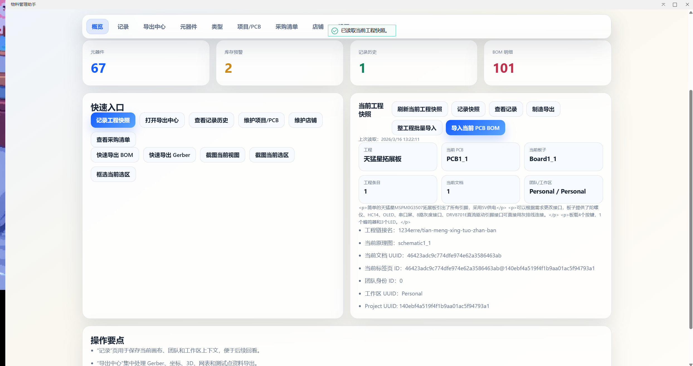
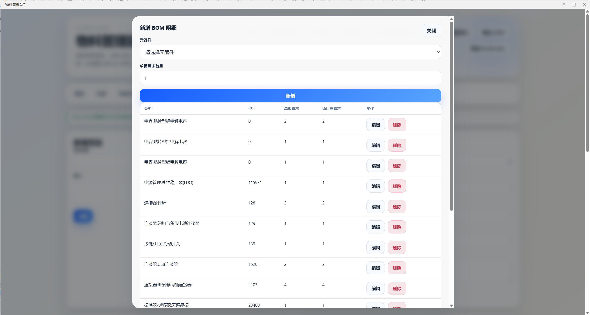
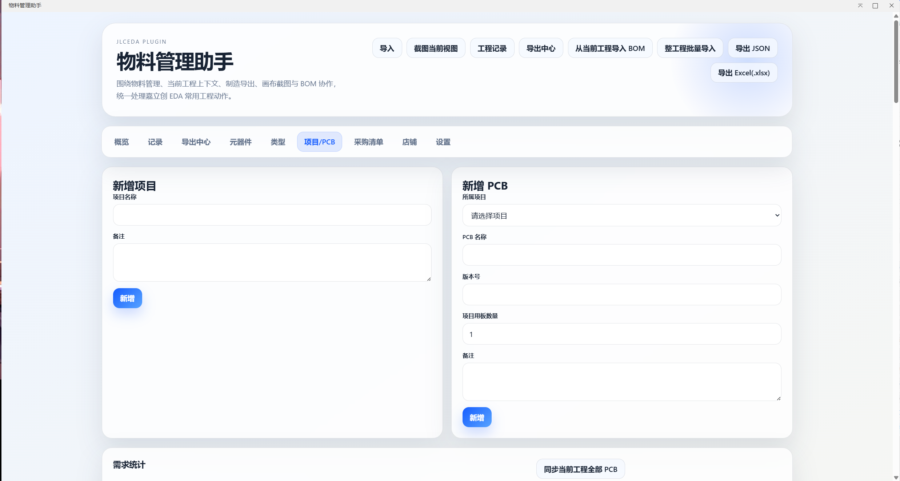
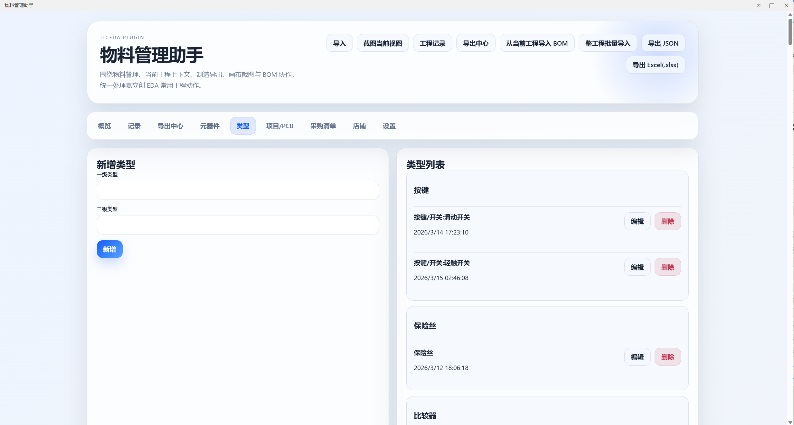
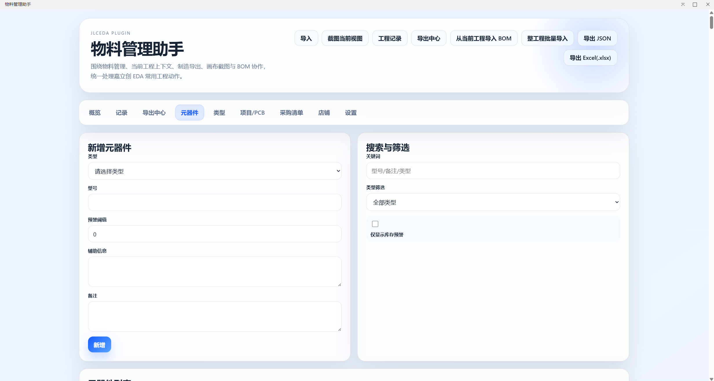
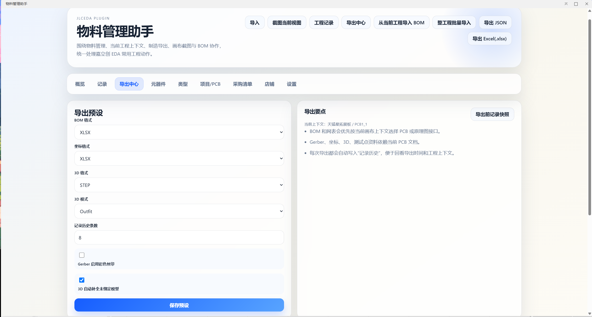
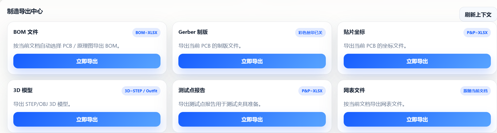
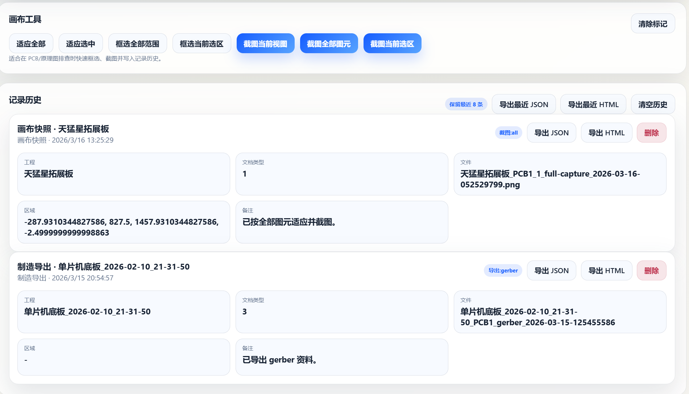

[简体中文](./README.md) | [English](#) | [繁體中文](./README.zh-Hant.md) | [日本語](./README.ja.md) | [Русский](./README.ru.md)

# Usage Guide

# Material Management Assistant

Material Management Assistant is a BOM and inventory extension for **JLCEDA Pro**. It opens an inline IFrame window inside the editor and helps hardware teams manage categories, components, purchase records, projects, PCBs, and BOMs in one place, with import and export support.

> JLCEDA API reference: [https://prodocs.lceda.cn/cn/api/guide/invoke-apis.html](https://prodocs.lceda.cn/cn/api/guide/invoke-apis.html)

## Features

- Category management: maintain primary and secondary category dictionaries.
- Component management: maintain model, auxiliary info, notes, warning threshold, PCB demand stats, and related PCBs.
- Purchase records: store platform, link, quantity, unit price, and supplier information for each component.
- Project / PCB / BOM: each project can contain multiple PCBs, and each PCB keeps its own BOM list.
- Purchase lists: generate shortage lists by project or PCB and export them as `JSON/CSV`.
- Current project sync: import BOM data from the active EDA project or sync the whole project in batch.
- Manufacturing export: export `BOM / Gerber / Pick&Place / 3D / Netlist / Test Point`.
- Canvas tools: fit view, selection capture, markers, screenshots, and history records.
- Preferences: switch language and light/dark theme.

## Feature Demo

### Import Your Current Project Data

On the main page, click "Record Project Snapshot" to save the current project context.



Click "Import Current PCB BOM" to batch import component data from the current project.



### Create Projects and PCB Entries

You can organize inventory around projects created in JLCEDA, making it easier to locate the components you need for the current design.

You can create projects and PCB entries directly in the extension.



### Create Categories and Components

The extension lets you manage component inventory with primary and secondary categories for clearer classification.




### Export Data

You can export current component data to your local computer, and import data back when you need to migrate inventory records quickly.



Besides BOM data, the extension also supports one-click export for other manufacturing outputs.



### Screenshots and Canvas Tools

The extension includes screenshot tools for the current view, current objects, and selected area. You can capture what you need in different ways.

It also supports saving project snapshots for later review.



## How to Use

1. Install the `.eext` package in JLCEDA Pro.
2. Find `物料管理助手` in the top menu and click `打开物料管理助手`.
3. On first launch, the extension initializes a default database automatically.

## Data Storage and Backup

- Extension data is stored in user configuration through `eda.sys_Storage`.
- It is recommended to export `JSON` regularly for offline backup. Use `Import` to restore data on another device.

## Import Formats

### JSON

- Full database import is supported, for example: `{ types: [], components: [], projects: [], pcbs: [], stores: [] }`.
- Component list import is also supported, for example: `[{ typeName, model, auxInfo?, note?, warningThreshold?, records? }]` or `{ items: [...] }`.

### CSV

- Only component list import is supported.
- Required columns: category (`type/typeName/类型`) and model (`model/型号`).
- Optional columns: `auxInfo/辅助信息`, `note/备注`, `warningThreshold/预警阈值`, `platform/平台`, `link/链接`, `quantity/数量`, `pricePerUnit/单价`.

### XLSX

- Files exported by this extension are detected and imported automatically.
- For a general `.xlsx`, the extension opens an import mapping dialog so you can choose the sheet and map the columns before import.

## Development and Build

Runtime: Node.js 20+

```shell
npm install
npm run build
```

Build artifacts are generated in `build/dist/*.eext`.

Entry files:

- Extension entry: [`src/index.ts`](./src/index.ts)
- IFrame app: [`iframe/src/app.ts`](./iframe/src/app.ts)

## Known Limitations

- Legacy binary `.xls` import is not implemented yet.
- Extension storage capacity depends on the host environment. For large datasets, export `JSON` regularly for archival backup.

## Open Source License

This project is released under Apache License 2.0.
