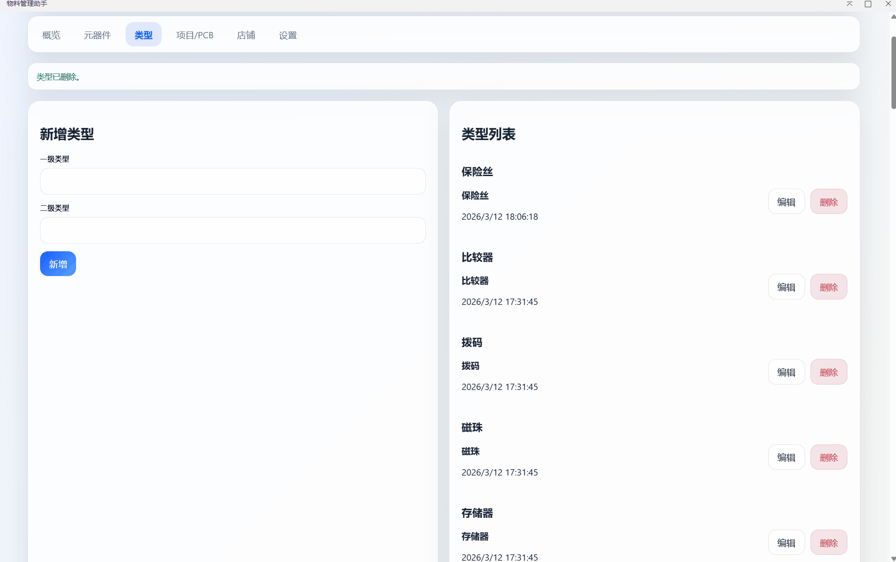
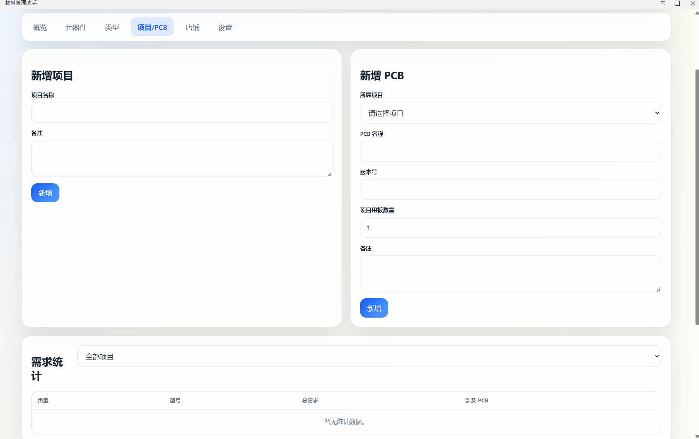

[简体中文](#)

# 使用方法

# 物料管理助手（BOM Manager）

面向硬件团队的 BOM 管理插件，运行在 **嘉立创 EDA 专业版** 扩展环境中：在插件内打开一个内联窗口（IFrame），完成类型、元器件、采购记录、项目、PCB 与 BOM 的统一维护，并提供导入导出能力。

> 嘉立创 API 文档参考：<https://prodocs.lceda.cn/cn/api/reference/pro-api.html>

## 功能

- 类型管理：维护一级/二级类型字典（元器件录入时单选）。
- 元器件管理：维护型号、辅助信息、备注、库存预警阈值；展示 PCB 需求统计与关联 PCB。
- 采购记录：为元器件维护多条采购记录（平台、链接、数量、价格、店铺关联）。
- 项目 / PCB / BOM：项目可挂多个 PCB，每个 PCB 独立维护 BOM 明细，并可按项目筛选统计需求总量。
- 采购清单：按项目或按 PCB 生成“需求 vs 库存”的缺口清单，并支持导出 `JSON/CSV` 方便采购下单。
- 店铺评价：维护平台店铺评分、参考价格、邮费、主卖品与备注。
- 导入导出：支持导入 `JSON/CSV/XLSX`；支持导出 `JSON/Excel(.xlsx)`。
- 偏好设置：中英文切换、亮色/暗色主题切换。

## 功能演示

> 以下 GIF 均来自本仓库 [`./images/`](./images/) 目录。

### 类型新增演示

<p align="center">
  
</p>

### 元器件新增及库存修改演示

<p align="center">
  
</p>

### PCB 项目管理及 BOM 管理演示

<p align="center">
  
</p>

## 使用方式

1. 在嘉立创 EDA 专业版中安装扩展包（`.eext`）。
2. 在顶部菜单中找到 `物料管理助手`，点击 `打开物料管理助手`。
3. 首次运行会自动初始化一份默认数据库（含“电阻/电容/芯片”基础类型）。

## 数据存储与备份

- 本插件数据保存在扩展的用户配置中（`eda.sys_Storage`），无需额外配置数据目录。
- 建议定期使用 `导出 JSON` 做离线备份；需要跨设备迁移时，可用 `导入` 导入导出的 JSON。

## 导入说明

### JSON

支持两种 JSON：

- 全量数据库：形如 `{ types: [], components: [], projects: [], pcbs: [], stores: [] }`，会整体覆盖当前数据。
- 元器件列表：形如 `[{ typeName, model, auxInfo?, note?, warningThreshold?, records? }]` 或 `{ items: [...] }`，会按 `typeName + model` 合并写入。

`records` 支持：`[{ platform, link, quantity, pricePerUnit }]`。

### CSV

- 仅支持元器件列表导入（会按列名自动识别并合并）。
- 必填列：类型（如 `type/typeName/类型`）与型号（如 `model/型号`）。
- 可选列：`auxInfo/辅助信息`、`note/备注`、`warningThreshold/预警阈值`、`platform/平台`、`link/链接`、`quantity/数量`、`pricePerUnit/单价`。

### XLSX

- 若为本插件导出的 `.xlsx`，会自动识别并导入。
- 若为普通 `.xlsx`，会弹出“导入映射”窗口，选择工作表并将列映射为类型/元器件/项目/店铺后导入。
- 暂不支持导入旧格式二进制 `.xls`，请另存为 `.xlsx` 或 `.csv`。

## 开发与构建

运行环境：Node.js 20+

```shell
npm install
npm run build
```

产物：`build/dist/*.eext`，在嘉立创 EDA 专业版中安装即可。

入口文件：

- 扩展入口：[`src/index.ts`](./src/index.ts)（导出 `openBomManager`，用于打开 IFrame 窗口）
- 内联应用：[`iframe/index.html`](./iframe/index.html) + `iframe/app.js` + `iframe/styles.css`

## 已知限制

- `.xls`（旧格式二进制）导入尚未实现。
- 插件存储容量受宿主限制，建议大型数据集使用“导出 JSON”做定期归档。

## 排错

- 若打开窗口后出现类似 404 或页面空白，通常是宿主版本对 `openIFrame()` 以及 IFrame 资源路径解析存在兼容性问题。建议优先升级到更新的嘉立创 EDA 专业版。
- IFrame 页面提供两种加载方式：
  - `iframe/index.html` 使用相对路径加载 `./app.js`、`./styles.css`（更适合离线环境）。
  - `iframe/index.abs.html` 使用绝对路径 `/iframe/app.js`、`/iframe/styles.css`（用于兼容部分旧版本）。
  插件入口会自动按顺序尝试两种页面，无需联网。

## 开源许可

本项目使用 Apache License 2.0。
